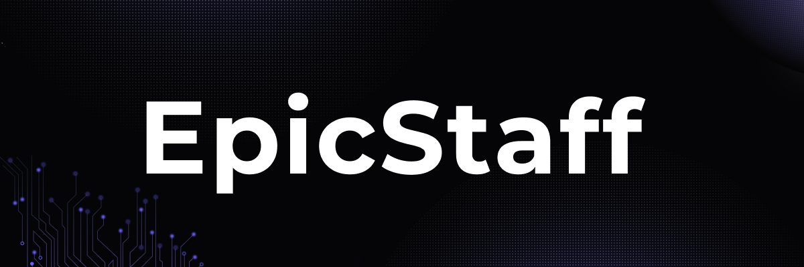

# EpicStaff - AI Agent Without The Frustration

AI agent don't need to be complicated. EpicStaff gives teams visual workflows and developers full backend control - in one platform.

---

**EpicStaff** is an open-source platform for building agent-based AI systems with maximum flexebility and minimum friction.
With **EpicStaff**, you can create AI agents that work quickly and efficiently, remember the context of your tasks and can make decisions based on the information they receive.

## We built EpicStaff because we've seen the gap and offers a dual-approach platform:

### 🔹For non-technical users:

Create multitasking AI agents through an intuitive interface. Use node-based programming frameworks to connect blocks in charge of actions: text analysis, response generation, working with files and CRM systems, etc.

### 🔹For developers:

A modular, transparent backend that enables fine-grained control and direct access to orchestration logic.

Whether you're experementing, prototyping, or deploying to production, EpicStaff adapts to your team:

- Use drag and drop when needed
- Dive into code when preferred
- Or combine both, seamlessly

We hide the comlexity, not the logic.

---
## 🎯 Who is EpicStaff ideal for?

- AI developers who desire flexibility without templates

- Business teams who wish to quickly create functional AI agents

- No-code users who prefer an interface over YAML

- R&D teams and startups working with agent systems

---

|  Feature                 |  Description                                                                 |
|--------------------------|------------------------------------------------------------------------------|
| 🧩 Graphic Project Builder | Build projects using a visual interface without writing any code             |
| 🧠 Memory Persistence      | Save and retrieve agent memory between steps                                 |
| 📚 Knowledge Injection     | Inject knowledge from files and structured data to improve results           |
| 🐍 Python Tools            | Connect your own Python tools without needing to redeploy                    |
| ⚙️ Developer Control       | Full control for developers via orchestration API                            |
| ⚡ High-Performance Core   | Asynchronous architecture optimized for speed                                |
| 🧱 Modular Backend         | Modular architecture that is easy to extend                                  |
| 🌍 Open-Source             | Open code and freedom for community-driven development                       |
| 🤖 LLM Compatibility       | Compatible with any language model and supports multi-step workflows         |

---

## Mission

To empower teams to build intelligant AI agent: quickly, collaboratively and without unnecessary complexity.

---

## 💎 Core Values

 **Clarity over complexity**

We hide the overhead, not the logic. Users stay focused on what matters: building, testing and delivering.

 **Collaboration by design**

EpicStaff build for teams: visual first for non-technical users, full code fllexebility for developers. Everyone works better, together.

 **Developer respect**
 
No black boxes. No magic. Just clean, extendable architecture that gives engineers the control they need.

**Open by default**

We believe in open ecosystems. That's why EpicStaff is fully open-source, modular and community driven.

## Join Us

Join the journey with **EpicStaff**, and together let’s shape the future of intelligent collaboration!

---

## 💫Show Your Support

If u find EpicStaff helpful - give it a ⭐️ on GitHub!

---

# Downloader

## Requirements
- **Git**  
- **Docker Desktop** (Must be running)

---

## 🚀 Getting Started

### Windows/Linux

1. **Install dependencies**  
   - [Git](https://github.com/EpicStaff/EpicStaff/releases/tag/Hackathon)  
   - [Docker Desktop](https://www.docker.com/products/docker-desktop/)

2. **Start Docker Desktop**

3. **Download the project**  

4. **Open the installer file. If Docker is not running, it will start automatically.**

5. **Your browser will open the installer page.**

6. **You will see a few basic control buttons:**
* **Start System**
*  **Update**
*  **Stop System**

7. **In the “Data Storage Location” section, select the folder on your computer where all system results and data will be stored by clicking the “Select” button.**
   
9. **Open the app**

After the system starts, wait until all the containers have finished loading (you will see them appear with the status Running). 
When everything is ready, a new button will appear: 

(Open Application)

Click it to enter the main application and start using the platform.

   Visit: [http://127.0.0.1:4200/](http://127.0.0.1:4200/)

---

### 🍎 macOS

1. **Install dependencies**  
   - [Git](https://github.com/EpicStaff/EpicStaff/releases/tag/Hackathon)  
   - [Docker Desktop](https://www.docker.com/products/docker-desktop/)

2. **Start Docker Desktop**

3. **Download the project**  

4. **🛠️ Mandatory steps for macOS**

For macOS, you will need to run additional commands in the terminal to make the program run in the unpacked directory.

Run the following commands to grant permissions and remove the quarantine attribute:

```bash
chmod -R epicstaff.app 
xattr -r -d com.apple.quarantine epicstaff.app
```

5. **Open the installer file. If Docker is not running, it will start automatically.**

6. **Your browser will open the installer page.**

7. **You will see a few basic control buttons:**
* **Start System**
*  **Update**
*  **Stop System**

8. **In the “Data Storage Location” section, select the folder on your computer where all system results and data will be stored by clicking the “Select” button.**
   
9. **Open the app**

After the system starts, wait until all the containers have finished loading (you will see them appear with the status Running). 
When everything is ready, a new button will appear: 

(Open Application)

Click it to enter the main application and start using the platform.

   Visit: [http://127.0.0.1:4200/](http://127.0.0.1:4200/)

   Full instruction is here [docs.pdf](https://github.com/Valeriia-dovhal-hys/EpicStaff/blob/b423d70c946e4132c910d97f168de6ee8b6f47f2/docs.pdf) 
